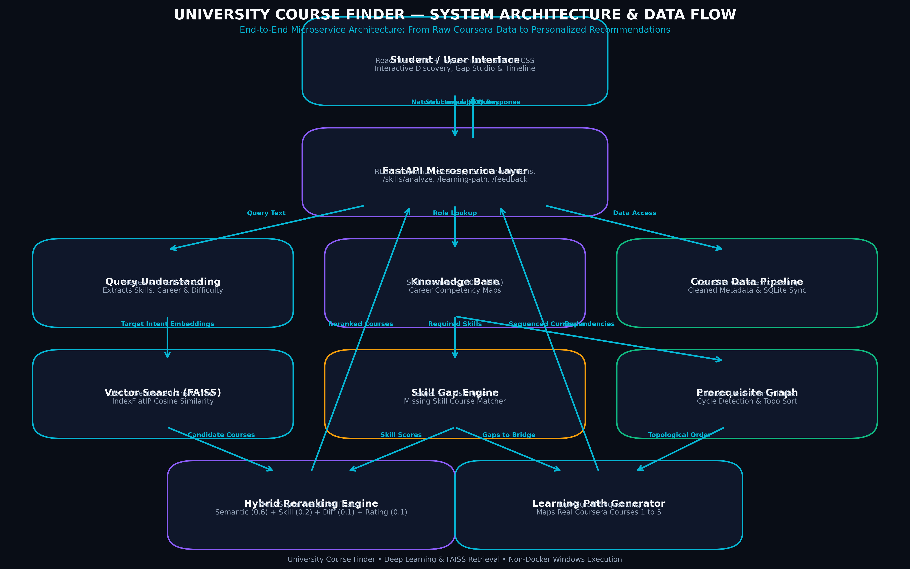
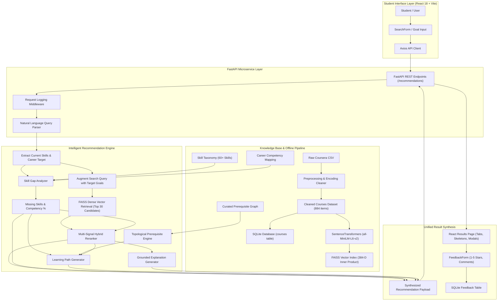

# University Course Finder — Architecture Documentation

## 1. System Overview & Architecture Diagram

The **University Course Finder** is a modular, production-style intelligent course discovery and personalized recommendation microservice system. It replaces brittle keyword search with dense semantic vector retrieval, rule-based skill gap detection, topological prerequisite graphs, and hybrid multi-factor reranking.

The system is deployed directly on Windows using **FastAPI (Python 3.10+)** and **React (Vite + TypeScript + Tailwind CSS)** without containerization or Docker.

---

## 2. End-to-End Data & Recommendation Flow

1. **Query Ingestion**:
   A student enters a natural-language goal (e.g., *"I know Python and SQL and want to become a machine learning engineer"*).
2. **Intent Parsing**:
   `query_parser.py` segments the query into:
   - **Existing Skills**: `['Python', 'SQL']`
   - **Target Career**: `'Machine Learning Engineer'`
   - **Desired Skills**: `['Machine Learning']`
   - **Difficulty Preference**: `'Adaptive / Any'`
3. **Skill Gap Diagnostics**:
   `skill_service.py` looks up standard industry requirements for the career (`['Python', 'Machine Learning', 'Deep Learning', 'Scikit-learn', 'TensorFlow', 'Mathematics', 'Model Deployment']`), identifies the deficit (`['Deep Learning', 'Machine Learning', 'Mathematics', 'Model Deployment', 'Scikit-learn', 'TensorFlow']`), and computes initial readiness ($28.6\%$).
4. **Semantic Vector Search**:
   The query is encoded via `all-MiniLM-L6-v2` into a 384-dimensional unit vector. FAISS performs an $O(N)$ inner product search across 884 normalized course vectors, returning the top candidate courses with cosine similarities. If FAISS or embeddings are unavailable, a TF-IDF cosine similarity fallback seamlessly takes over.
5. **Multi-Signal Hybrid Reranking**:
   Candidates are scored using normalized multi-factor criteria:
   $$\text{Final Score} = w_{\text{sem}} \cdot S_{\text{sem}} + w_{\text{skill}} \cdot S_{\text{skill}} + w_{\text{diff}} \cdot S_{\text{diff}} + w_{\text{rating}} \cdot S_{\text{rating}} + w_{\text{career}} \cdot S_{\text{career}}$$
   Courses closing critical skill gaps receive higher priority.
6. **Topological Curriculum Sequencing**:
   `learning_path_service.py` orders required competencies from foundational mathematics to core machine learning and applied specialization using Kahn's topological sort on the educational prerequisite DAG. Each step is matched with a real Coursera course.
7. **Educational Explanation**:
   Factual explanations are generated using genuine course metadata, matched skills, and user requirements.
8. **Feedback Loop**:
   Students can rate recommendations and courses (1–5 stars, useful/not useful, optional commentary). Feedback is recorded in SQLite (`course_finder.db`) and aggregated in `/api/v1/feedback/stats`.

---

## 3. Subsystem Breakdown

| Subsystem | Primary Tech | Role | Key File |
| :--- | :--- | :--- | :--- |
| **API Server** | FastAPI, Uvicorn | REST endpoints, CORS, request timing, Swagger UI | `backend/app/main.py` |
| **Query Parser** | Python regex, Tokenizers | Intent extraction, skill & career detection | `backend/app/services/query_parser.py` |
| **Embeddings** | Sentence-Transformers | 384-D dense embeddings (`all-MiniLM-L6-v2`) | `backend/app/services/embedding_service.py` |
| **Vector Store** | FAISS (`IndexFlatIP`) | Fast inner-product similarity search | `backend/app/services/search_service.py` |
| **Hybrid Reranker** | NumPy, Python | Multi-criteria score normalization and fusion | `backend/app/services/ranking_service.py` |
| **Skill Gap Analyzer**| Taxonomy Graph | Target career skill audits, gap courses | `backend/app/services/skill_service.py` |
| **Prerequisite Engine**| Directed Acyclic Graph | Cycle detection, topological sort, explanations | `backend/app/services/prerequisite_service.py` |
| **Learning Path** | Topological Planner | Step-by-step sequential curriculum generation | `backend/app/services/learning_path_service.py` |
| **Database** | SQLite, SQLAlchemy | Stores courses metadata and feedback entries | `backend/app/database.py` |
| **Frontend** | React 18, Vite, TS, Tailwind| Modern responsive UI with tabs, modals, filters | `frontend/src/` |

---

## 4. Hardware & Operating Environment
- **Operating System**: Microsoft Windows (Native PowerShell execution)
- **Runtime**: Python 3.10+ & Node.js 18+
- **Containerization**: **None (No Docker, no containers)**
- **Network**: Operates entirely locally with local FAISS index and SQLite file
